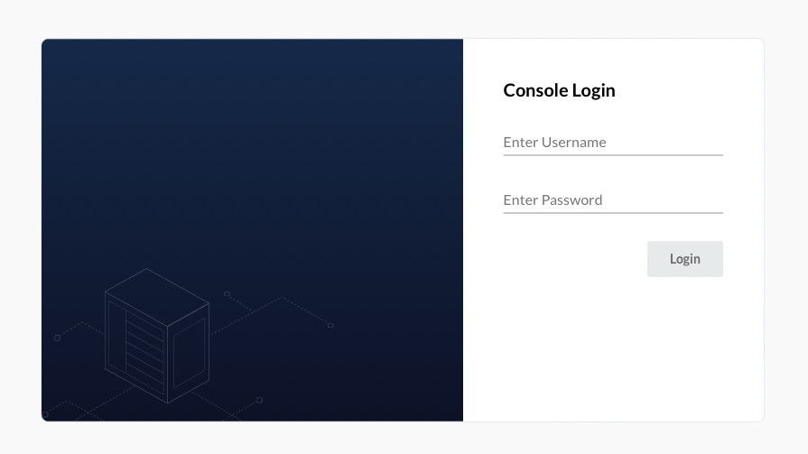
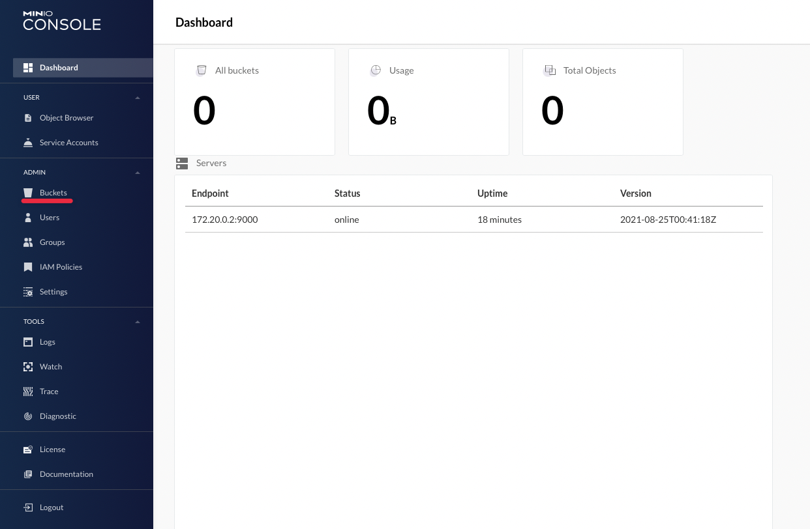
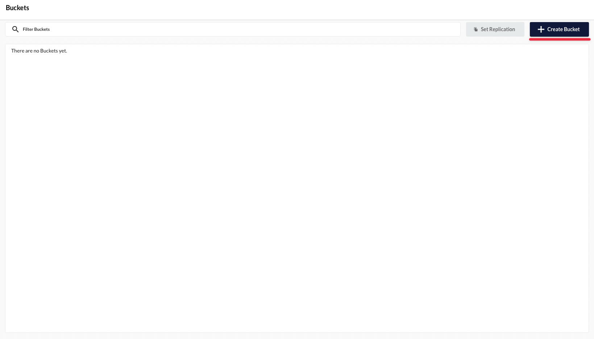
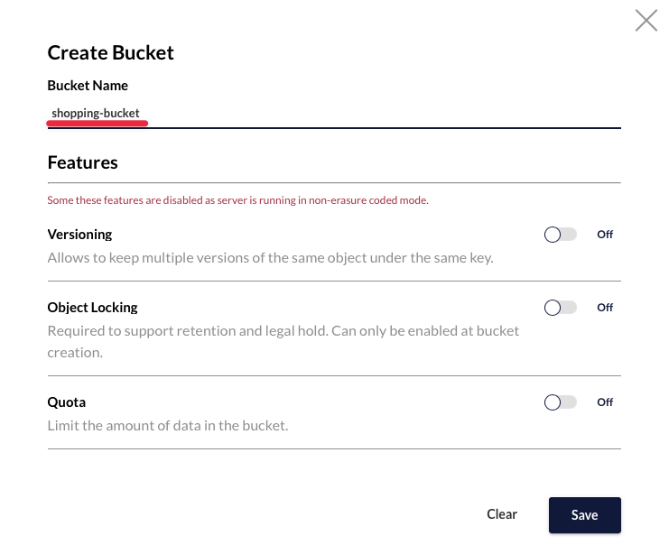
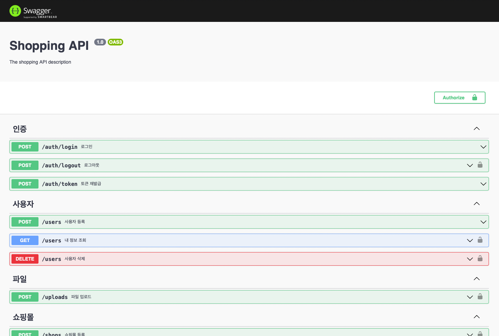

# 프로젝트명

> 쇼핑몰을 관리할수 있는 API 입니다.

## 설치 환경

- npm >= 6.14.16
- node >= 14.19.0
- yarn >= 1.22.17
- mysql >= 8.0.28
- docker >= 20.10.12

## 개발 환경 설정

#### 의존성 설치

```bash
$ yarn install
```

#### 데이터베이스 생성

```sql
mysql> CREATE DATABASE `shopping-app` DEFAULT CHARACTER SET = `utf8mb4` DEFAULT COLLATE = `utf8mb4_0900_ai_ci`;
```

#### minio

로컬 환경에서 이미지 업로드를 위한 minio을 설치합니다.  
환경변수를 수정하는것만으로 S3와 호환되며 코드의 변경없이 사용할 수 있습니다.
minio는 해당 프로젝트의 docker-compose.yml을 이용하여 실행할 수 있습니다.

##### 설치 및 실행

```bash
$ docker-compose -up
```

##### 버킷 생성

콘솔 페이지 [http://127.0.0.1:9001](http://127.0.0.1:9001) 으로 접속합니다.


아이디 minio
비밀번호 password

아이디와 비밀번호는 ACCESS_KEY와 SECRET_ACCESS_KEY로 사용 됩니다.





다음과 같이 이동한뒤 버킷을 생성합니다.

#### 환경 변수 설정

개발환경과 배포환경에서 사용되는 .env 파일을 개별의 파일로 관리됩니다.
각 환경에서 사용되는 파일의 이름은 다음과 같습니다.

- 개발환경 .env.development
- 배포환경 .env.production

.env.sample의 이름을 .env.development로 변경하여 환경변수를 설정합니다.
각 항목의 설명은 아래와 같습니다.

```
# App
PORT=어플리케이션 포트

# Database
DATABASE_HOST=데이터베이스 주소
DATABASE_PORT=데이터베이스 포트
DATABASE_USERNAME=데이터베이스 아이디
DATABASE_PASSWORD=데이터베이스 비밀번호
DATABASE_NAME=데이터베이스 이름

# JWT
JWT_ACCESS_TOKEN_SECRET=인증 토큰 비밀번호
JWT_ACCESS_TOKEN_EXPIRESIN=인증 토큰 유효기간
JWT_REFRESH_TOKEN_SECRET=재발급 토큰 비밀번호
JWT_REFRESH_TOKEN_EXPIRESIN=재발급 토큰 유효기간


# AWS
AWS_S3_BUCKET_NAME=AWS S3 버킷이름
AWS_ACCESS_KEY_ID=AWS S3 ACCESS KEY
AWS_SECRET_ACCESS_KEY=AWS S3 SECRET ACCESS KEY
AWS_REGION=AWS S3 지역
AWS_END_POINT=로컬환경에서 사용시 minio IP
```

_minio 사용시 END POINT는 자신의 아이피:9000 입니다._  
_localhost 또는 127.0.0.1을 입력하는 경우 접속되지 않습니다._

## 프로젝트 실행

- 개발환경

  - 프로젝트 실행

  ```bash
    $ yarn start:dev
  ```

- 배포환경
  - 프로젝트 빌드
  ```bash
    $ yarn build
  ```
  - 프로젝트 실행
  ```bash
    $ yarn start:prod
  ```

### API

프로젝트 실행후 해당 프로젝트의 모든 기능들은 아래의 링크에서 확인할 수 있습니다.

- [http://localhost:3000/api-docs](http://localhost:3000/api-docs)



### 변경점

- AccessToken및 RefreshToken 사용
- Product 조회 기능 필터에서 평점순 조회를 위해 상품등록시 랜덤으로 평점 등록
